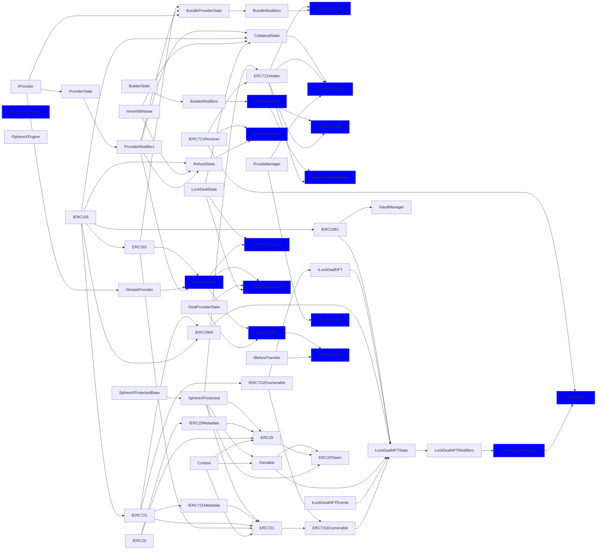

```mermaid
flowchart LR
BundleModifiers_542357b9763b887843028eb223a4c26c[BundleModifiers]
BundleProviderState_e842a200f1d19665faf671cd9922d3b9 --> BundleModifiers_542357b9763b887843028eb223a4c26c

BundleProvider_762e2f06c6f579d356b6eb5f6f8d7b3c[BundleProvider]:::changed
BundleModifiers_542357b9763b887843028eb223a4c26c --> BundleProvider_762e2f06c6f579d356b6eb5f6f8d7b3c
ERC721Holder_f1054d0b92b0c63c5ed34371506d18e2 --> BundleProvider_762e2f06c6f579d356b6eb5f6f8d7b3c

BundleProviderState_e842a200f1d19665faf671cd9922d3b9[BundleProviderState]
IProvider_887adbd3e7aca3c5905e515c40120246 --> BundleProviderState_e842a200f1d19665faf671cd9922d3b9
ProviderModifiers_556dc1a52adec65d93a535650aed2db7 --> BundleProviderState_e842a200f1d19665faf671cd9922d3b9
ERC165_746e604f94568096cba28717aaeaa9a3 --> BundleProviderState_e842a200f1d19665faf671cd9922d3b9

CollateralProvider_abe04ba4f2c052a8b9661902b23496d8[CollateralProvider]:::changed
IFundsManager_a0690549931255c3af8367e9720def77 --> CollateralProvider_abe04ba4f2c052a8b9661902b23496d8
ERC721Holder_f1054d0b92b0c63c5ed34371506d18e2 --> CollateralProvider_abe04ba4f2c052a8b9661902b23496d8
CollateralState_5ca4f210184827a2c3ec68726c207386 --> CollateralProvider_abe04ba4f2c052a8b9661902b23496d8

CollateralState_5ca4f210184827a2c3ec68726c207386[CollateralState]
LockDealState_f38248e7d394e56786d8c876919aaa57 --> CollateralState_5ca4f210184827a2c3ec68726c207386
IInnerWithdraw_ed13f809232cef7ac57099b264a02562 --> CollateralState_5ca4f210184827a2c3ec68726c207386
IERC165_835aab86bca7c6efcab3589701340b91 --> CollateralState_5ca4f210184827a2c3ec68726c207386
ProviderModifiers_556dc1a52adec65d93a535650aed2db7 --> CollateralState_5ca4f210184827a2c3ec68726c207386

RefundProvider_cd584bad0c2f0bc7435e25629f393394[RefundProvider]:::changed
RefundState_353702cdf6a6a086af7cf2f071f21925 --> RefundProvider_cd584bad0c2f0bc7435e25629f393394
IERC721Receiver_895494a1838c219c07bcc55cb0cf722a --> RefundProvider_cd584bad0c2f0bc7435e25629f393394

RefundState_353702cdf6a6a086af7cf2f071f21925[RefundState]
ProviderModifiers_556dc1a52adec65d93a535650aed2db7 --> RefundState_353702cdf6a6a086af7cf2f071f21925
IInnerWithdraw_ed13f809232cef7ac57099b264a02562 --> RefundState_353702cdf6a6a086af7cf2f071f21925
IERC165_835aab86bca7c6efcab3589701340b91 --> RefundState_353702cdf6a6a086af7cf2f071f21925

BuilderInternal_70dd8d3076f756d74b533eacba110286[BuilderInternal]:::changed
BuilderModifiers_4109297db7eabf40f3e2576f3cb95c23 --> BuilderInternal_70dd8d3076f756d74b533eacba110286

BuilderModifiers_4109297db7eabf40f3e2576f3cb95c23[BuilderModifiers]
BuilderState_2090e3ff13e1473244c8599444553ac4 --> BuilderModifiers_4109297db7eabf40f3e2576f3cb95c23

BuilderState_2090e3ff13e1473244c8599444553ac4[BuilderState]

SimpleBuilder_f81e63ba54414d524659d89a77dba136[SimpleBuilder]:::changed
ERC721Holder_f1054d0b92b0c63c5ed34371506d18e2 --> SimpleBuilder_f81e63ba54414d524659d89a77dba136
BuilderInternal_70dd8d3076f756d74b533eacba110286 --> SimpleBuilder_f81e63ba54414d524659d89a77dba136

SimpleRefundBuilder_f246cbe842cab9e438ce9b88696802c1[SimpleRefundBuilder]:::changed
ERC721Holder_f1054d0b92b0c63c5ed34371506d18e2 --> SimpleRefundBuilder_f246cbe842cab9e438ce9b88696802c1
BuilderInternal_70dd8d3076f756d74b533eacba110286 --> SimpleRefundBuilder_f246cbe842cab9e438ce9b88696802c1

ILockDealNFTEvents_280217d8b4388f28d2a09722ccee345c[ILockDealNFTEvents]

LockDealNFT_6a38fa9c816fdd9c587f1dec3ed4b3ff[LockDealNFT]:::changed
LockDealNFTInternal_7065fcc5b26e584043d84b3441f39b32 --> LockDealNFT_6a38fa9c816fdd9c587f1dec3ed4b3ff
IERC721Receiver_895494a1838c219c07bcc55cb0cf722a --> LockDealNFT_6a38fa9c816fdd9c587f1dec3ed4b3ff

LockDealNFTInternal_7065fcc5b26e584043d84b3441f39b32[LockDealNFTInternal]:::changed
LockDealNFTModifiers_0924017cd3d39bb7fda744f829f4451b --> LockDealNFTInternal_7065fcc5b26e584043d84b3441f39b32

LockDealNFTModifiers_0924017cd3d39bb7fda744f829f4451b[LockDealNFTModifiers]
LockDealNFTState_495b0c87ad88892d339f4dc1fb0abccb --> LockDealNFTModifiers_0924017cd3d39bb7fda744f829f4451b

LockDealNFTState_495b0c87ad88892d339f4dc1fb0abccb[LockDealNFTState]
ERC721Enumerable_bc20c138963ae133f350717519650d17 --> LockDealNFTState_495b0c87ad88892d339f4dc1fb0abccb
ILockDealNFTEvents_280217d8b4388f28d2a09722ccee345c --> LockDealNFTState_495b0c87ad88892d339f4dc1fb0abccb
Ownable_9a2d3f241f325583123387dc02f9351e --> LockDealNFTState_495b0c87ad88892d339f4dc1fb0abccb
IERC4906_f65f44fa6b583a4a7cdb5f5350c03aa0 --> LockDealNFTState_495b0c87ad88892d339f4dc1fb0abccb
ILockDealNFT_c435ed68bf12b1895d87a6f9c1c8f048 --> LockDealNFTState_495b0c87ad88892d339f4dc1fb0abccb
IERC2981_dbb3707d751a16880c239a35e5de9c5d --> LockDealNFTState_495b0c87ad88892d339f4dc1fb0abccb

DealProvider_16ff2adce3c6cfd3d3068a2de4abdf26[DealProvider]:::changed
DealProviderState_2ea7a5f6a2c92f017c38037de9aa1c1a --> DealProvider_16ff2adce3c6cfd3d3068a2de4abdf26
BasicProvider_5ed689f0765a6936bb5a5c5a397dd372 --> DealProvider_16ff2adce3c6cfd3d3068a2de4abdf26

DealProviderState_2ea7a5f6a2c92f017c38037de9aa1c1a[DealProviderState]

LockDealProvider_3a32d796c3aa3687e9b1113374755612[LockDealProvider]:::changed
BasicProvider_5ed689f0765a6936bb5a5c5a397dd372 --> LockDealProvider_3a32d796c3aa3687e9b1113374755612
LockDealState_f38248e7d394e56786d8c876919aaa57 --> LockDealProvider_3a32d796c3aa3687e9b1113374755612

LockDealState_f38248e7d394e56786d8c876919aaa57[LockDealState]

BasicProvider_5ed689f0765a6936bb5a5c5a397dd372[BasicProvider]:::changed
ProviderModifiers_556dc1a52adec65d93a535650aed2db7 --> BasicProvider_5ed689f0765a6936bb5a5c5a397dd372
ISimpleProvider_658bb759ba13d5e7e0f82cb07692f66b --> BasicProvider_5ed689f0765a6936bb5a5c5a397dd372
ERC165_746e604f94568096cba28717aaeaa9a3 --> BasicProvider_5ed689f0765a6936bb5a5c5a397dd372

ProviderModifiers_556dc1a52adec65d93a535650aed2db7[ProviderModifiers]
ProviderState_b0a6dd8984c094770b99edad383276d9 --> ProviderModifiers_556dc1a52adec65d93a535650aed2db7

ProviderState_b0a6dd8984c094770b99edad383276d9[ProviderState]
IProvider_887adbd3e7aca3c5905e515c40120246 --> ProviderState_b0a6dd8984c094770b99edad383276d9

TimedDealProvider_2547aae6c56a578e7277db371d46c04d[TimedDealProvider]:::changed
LockDealState_f38248e7d394e56786d8c876919aaa57 --> TimedDealProvider_2547aae6c56a578e7277db371d46c04d
DealProviderState_2ea7a5f6a2c92f017c38037de9aa1c1a --> TimedDealProvider_2547aae6c56a578e7277db371d46c04d
BasicProvider_5ed689f0765a6936bb5a5c5a397dd372 --> TimedDealProvider_2547aae6c56a578e7277db371d46c04d

IBeforeTransfer_d3b631fe1d4ebf06a15f313a8c078b0e[IBeforeTransfer]

IFundsManager_a0690549931255c3af8367e9720def77[IFundsManager]

IInnerWithdraw_ed13f809232cef7ac57099b264a02562[IInnerWithdraw]

ILockDealNFT_c435ed68bf12b1895d87a6f9c1c8f048[ILockDealNFT]
IERC721Enumerable_7b7fbe244e05ee2aeaecc136056833d1 --> ILockDealNFT_c435ed68bf12b1895d87a6f9c1c8f048

IProvider_887adbd3e7aca3c5905e515c40120246[IProvider]

ISimpleProvider_658bb759ba13d5e7e0f82cb07692f66b[ISimpleProvider]
IProvider_887adbd3e7aca3c5905e515c40120246 --> ISimpleProvider_658bb759ba13d5e7e0f82cb07692f66b

MockProvider_248141dcbfde19219f5d05b88a04d29a[MockProvider]:::changed
IFundsManager_a0690549931255c3af8367e9720def77 --> MockProvider_248141dcbfde19219f5d05b88a04d29a

MockTransfer_cd0700453633b3e3e37b72f55633ce0c[MockTransfer]:::changed
IBeforeTransfer_d3b631fe1d4ebf06a15f313a8c078b0e --> MockTransfer_cd0700453633b3e3e37b72f55633ce0c
DealProvider_16ff2adce3c6cfd3d3068a2de4abdf26 --> MockTransfer_cd0700453633b3e3e37b72f55633ce0c

MockVaultManager_055255c13ab3d3ae5ca2e2b1b2278c36[MockVaultManager]:::changed

ISphereXEngine_c0238a0322fab779e801ccf941e15695[ISphereXEngine]

SphereXProtected_040ee07d24f32034294fb3554f7aeb97[SphereXProtected]
SphereXProtectedBase_edb68ce26cf23a7a04dd3074eea78f99 --> SphereXProtected_040ee07d24f32034294fb3554f7aeb97

SphereXProtectedBase_edb68ce26cf23a7a04dd3074eea78f99[SphereXProtectedBase]

Ownable_9a2d3f241f325583123387dc02f9351e[Ownable]
Context_5db5bf71c9e4420c201112aecffddd12 --> Ownable_9a2d3f241f325583123387dc02f9351e
SphereXProtected_040ee07d24f32034294fb3554f7aeb97 --> Ownable_9a2d3f241f325583123387dc02f9351e

IERC2981_dbb3707d751a16880c239a35e5de9c5d[IERC2981]
IERC165_835aab86bca7c6efcab3589701340b91 --> IERC2981_dbb3707d751a16880c239a35e5de9c5d

IERC4906_f65f44fa6b583a4a7cdb5f5350c03aa0[IERC4906]
IERC165_835aab86bca7c6efcab3589701340b91 --> IERC4906_f65f44fa6b583a4a7cdb5f5350c03aa0
IERC721_703118a9b91a23dcb447e627e68a098b --> IERC4906_f65f44fa6b583a4a7cdb5f5350c03aa0

ERC20_af90f3e62639ccd7c41b59070c340e79[ERC20]
Context_5db5bf71c9e4420c201112aecffddd12 --> ERC20_af90f3e62639ccd7c41b59070c340e79
IERC20_b71e6471d74b0c3bb28ef71b2b763609 --> ERC20_af90f3e62639ccd7c41b59070c340e79
IERC20Metadata_78dfe78acb4c3f4c9595c672a67797ee --> ERC20_af90f3e62639ccd7c41b59070c340e79
SphereXProtected_040ee07d24f32034294fb3554f7aeb97 --> ERC20_af90f3e62639ccd7c41b59070c340e79

IERC20_b71e6471d74b0c3bb28ef71b2b763609[IERC20]

IERC20Metadata_78dfe78acb4c3f4c9595c672a67797ee[IERC20Metadata]
IERC20_b71e6471d74b0c3bb28ef71b2b763609 --> IERC20Metadata_78dfe78acb4c3f4c9595c672a67797ee

ERC721_3f69dffc821961cd33fd7b279ecb2c32[ERC721]
Context_5db5bf71c9e4420c201112aecffddd12 --> ERC721_3f69dffc821961cd33fd7b279ecb2c32
ERC165_746e604f94568096cba28717aaeaa9a3 --> ERC721_3f69dffc821961cd33fd7b279ecb2c32
IERC721_703118a9b91a23dcb447e627e68a098b --> ERC721_3f69dffc821961cd33fd7b279ecb2c32
IERC721Metadata_f98deb066d8aadf107eb1ace9310cbdc --> ERC721_3f69dffc821961cd33fd7b279ecb2c32
SphereXProtected_040ee07d24f32034294fb3554f7aeb97 --> ERC721_3f69dffc821961cd33fd7b279ecb2c32

IERC721_703118a9b91a23dcb447e627e68a098b[IERC721]
IERC165_835aab86bca7c6efcab3589701340b91 --> IERC721_703118a9b91a23dcb447e627e68a098b

IERC721Receiver_895494a1838c219c07bcc55cb0cf722a[IERC721Receiver]

ERC721Enumerable_bc20c138963ae133f350717519650d17[ERC721Enumerable]
ERC721_3f69dffc821961cd33fd7b279ecb2c32 --> ERC721Enumerable_bc20c138963ae133f350717519650d17
IERC721Enumerable_7b7fbe244e05ee2aeaecc136056833d1 --> ERC721Enumerable_bc20c138963ae133f350717519650d17

IERC721Enumerable_7b7fbe244e05ee2aeaecc136056833d1[IERC721Enumerable]
IERC721_703118a9b91a23dcb447e627e68a098b --> IERC721Enumerable_7b7fbe244e05ee2aeaecc136056833d1

IERC721Metadata_f98deb066d8aadf107eb1ace9310cbdc[IERC721Metadata]
IERC721_703118a9b91a23dcb447e627e68a098b --> IERC721Metadata_f98deb066d8aadf107eb1ace9310cbdc

ERC721Holder_f1054d0b92b0c63c5ed34371506d18e2[ERC721Holder]
IERC721Receiver_895494a1838c219c07bcc55cb0cf722a --> ERC721Holder_f1054d0b92b0c63c5ed34371506d18e2
SphereXProtected_040ee07d24f32034294fb3554f7aeb97 --> ERC721Holder_f1054d0b92b0c63c5ed34371506d18e2

Context_5db5bf71c9e4420c201112aecffddd12[Context]

ERC165_746e604f94568096cba28717aaeaa9a3[ERC165]
IERC165_835aab86bca7c6efcab3589701340b91 --> ERC165_746e604f94568096cba28717aaeaa9a3

IERC165_835aab86bca7c6efcab3589701340b91[IERC165]

IVaultManager_b6291f02f4e7c58b16276760e997753b[IVaultManager]
IERC2981_dbb3707d751a16880c239a35e5de9c5d --> IVaultManager_b6291f02f4e7c58b16276760e997753b

ERC20Token_496f30103fdd3387fe5662b2c26ea236[ERC20Token]
SphereXProtected_040ee07d24f32034294fb3554f7aeb97 --> ERC20Token_496f30103fdd3387fe5662b2c26ea236
ERC20_af90f3e62639ccd7c41b59070c340e79 --> ERC20Token_496f30103fdd3387fe5662b2c26ea236
Ownable_9a2d3f241f325583123387dc02f9351e --> ERC20Token_496f30103fdd3387fe5662b2c26ea236

classDef changed fill:blue
```
